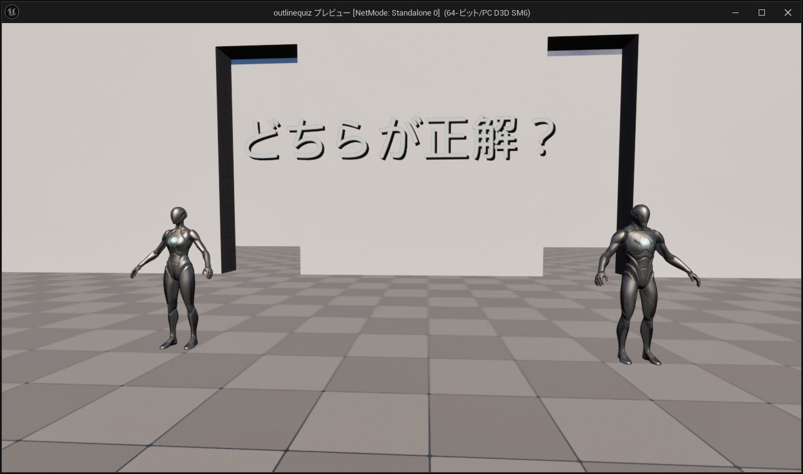

# 概要
ぷちコン第23回 白黒シルエットクイズ! 応募 リポジトリ

# ゲーム内容
形を覚えて、クイズに答えよう！
黒い画面に、白の"線(せん)"で、形のシルエットを作りました。

# ゲーム画面

# 応募した動画
- [UE5ぷちコン 第23回] 白黒シルエットクイズ！
  - https://www.youtube.com/watch?v=4nbE8h3fApI

# ぷちコンについて
- ぷちコンは株式会社ヒストリア主催のコンテストです。
   - https://historia.co.jp/ue-petitcon/

# 技術
- ポストプロセス > アウトラインシェーダー

# 参考リンク
- UE5ゲーム制作講座】目指せアウトラインマスター【背面法とポストプロセス】
   - https://www.youtube.com/watch?v=0dsBg9_FFAw&t=477s
